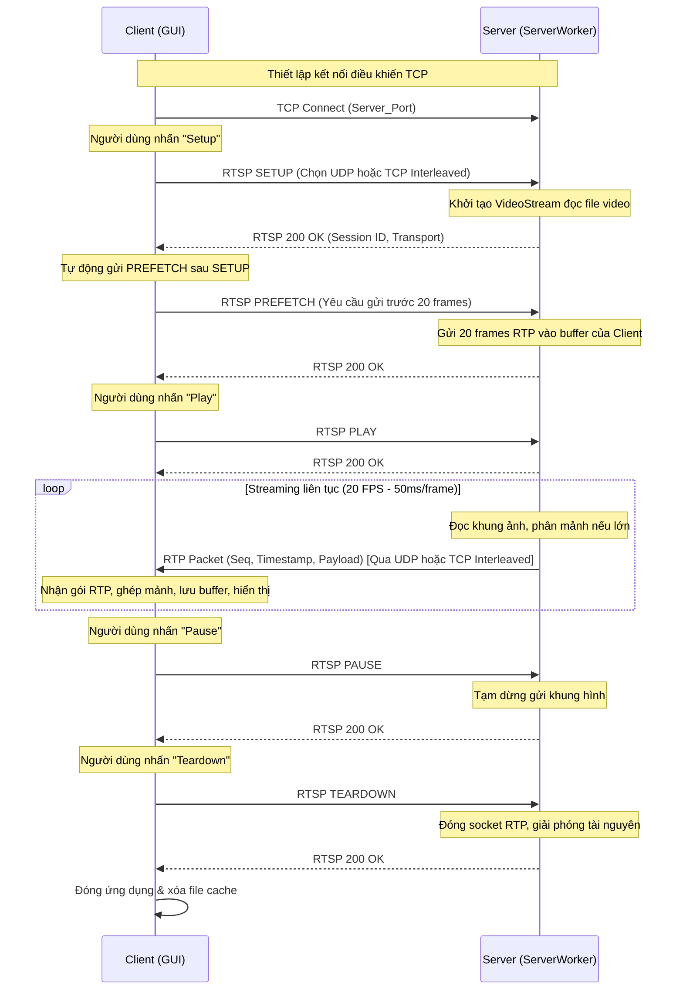
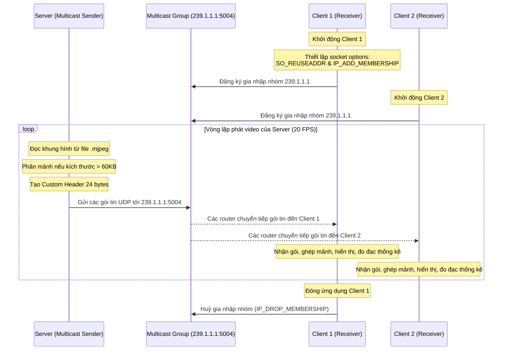

# HƯỚNG DẪN CHI TIẾT ĐỒ ÁN LẬP TRÌNH MẠNG

Tài liệu này được biên soạn để giúp bạn hiểu sâu sắc và toàn diện về hai đồ án Lập Trình Mạng (LTM) trong workspace:
1. **Project 01**: Video Streaming sử dụng giao thức điều khiển **RTSP** và giao thức truyền tải **RTP** (hỗ trợ Unicast qua cả UDP và TCP Interleaved).
2. **Project 02**: Video Streaming qua **IP Multicast** sử dụng giao thức **UDP** với định dạng gói tin tùy biến (Custom Packet) hỗ trợ phân mảnh (Fragmentation).

Tài liệu này bao gồm lý thuyết nền tảng, giải thích chi tiết từng dòng code của từng file trong cả hai dự án, các sơ đồ hoạt động, hướng dẫn chạy thử nghiệm và đặc biệt là **bộ câu hỏi vấn đáp (Q&A)** giúp bạn chuẩn bị tốt nhất cho buổi bảo vệ đồ án trước các thầy cô.

---

## MỤC LỤC
1. [Lý Thuyết Mạng Nền Tảng (Phục vụ Vấn Đáp)](#1-lý-thuyết-mạng-nền-tảng)
2. [Chi Tiết Project 01: Video Streaming qua RTSP & RTP](#2-chi-tiết-project-01-rtsp--rtp)
   - [Kiến trúc & Sơ đồ luồng](#21-kiến-trúc--sơ-đồ-luồng)
   - [Giải thích Code RtpPacket.py](#22-rtppacketpy)
   - [Giải thích Code VideoStream.py](#23-videostreampy)
   - [Giải thích Code Server.py](#24-serverpy)
   - [Giải thích Code ServerWorker.py](#25-serverworkerpy)
   - [Giải thích Code Client.py](#26-clientpy)
   - [Giải thích Code ClientLauncher.py](#27-clientlauncherpy)
3. [Chi Tiết Project 02: Multicast Video Streaming](#3-chi-tiết-project-02-multicast-video-streaming)
   - [Kiến trúc & Sơ đồ luồng](#31-kiến-trúc--sơ-đồ-luồng-multicast)
   - [Giải thích Code Server.py](#32-serverpy-multicast)
   - [Giải thích Code Client.py](#33-clientpy-multicast)
4. [Bộ Câu Hỏi Vấn Đáp Thường Gặp & Cách Trả Lời Ghi Điểm](#4-bộ-câu-hỏi-vấn-đáp-thường-gặp)
5. [Hướng Dẫn Cài Đặt, Chạy Thử Nghiệm & Debug Lỗi](#5-hướng-dẫn-cài-đặt-chạy-thử-nghiệm--debug)

---

## 1. LÝ THUYẾT MẠNG NỀN TẢNG

Để bảo vệ tốt đồ án, bạn phải phân biệt rõ các khái niệm cốt lõi sau:

### 1.1. Unicast vs. Multicast vs. Broadcast
*   **Unicast (Một - Một):** Dữ liệu được gửi từ một máy nguồn đến duy nhất một máy đích. Ví dụ: Client kết nối tới Server trong Project 01. Nếu có 100 client xem video, Server phải nhân bản luồng dữ liệu 100 lần và gửi 100 luồng riêng biệt $\rightarrow$ Làm quá tải băng thông Server.
*   **Multicast (Một - Nhiều có chọn lọc):** Dữ liệu được gửi từ một nguồn đến một nhóm máy đích đã đăng ký gia nhập nhóm (Multicast Group). Ví dụ trong Project 02. Server chỉ cần gửi **duy nhất 1 bản sao** gói tin đến địa chỉ Multicast (ví dụ `239.1.1.1`). Các router/switch trung gian sẽ tự động nhân bản gói tin tại các nút rẽ nhánh để chuyển tới các client tham gia nhóm. Tiết kiệm băng thông cực lớn cho Server.
*   **Broadcast (Một - Tất cả):** Gửi dữ liệu tới tất cả các thiết bị trong cùng một phân đoạn mạng (subnet), bất kể thiết bị đó có muốn nhận hay không. Thường dùng trong mạng LAN (ví dụ giao thức ARP), không truyền đi xa qua các router được.

### 1.2. RTSP (Real-Time Streaming Protocol) là gì?
RTSP là giao thức điều khiển tầng ứng dụng (chạy trên TCP port mặc định `554`, trong đồ án này chạy trên port tùy chọn của Server). Nó đóng vai trò giống như một **"chiếc điều khiển từ xa"** (Remote Control) cho luồng media:
*   Nó **không tự truyền dữ liệu video**, mà nó điều khiển các hành động của Server: Khởi tạo (`SETUP`), Phát (`PLAY`), Tạm dừng (`PAUSE`), Kết thúc (`TEARDOWN`).
*   Truyền tải lệnh điều khiển thông qua các yêu cầu dạng text tương tự như HTTP (gồm Method, CSeq, Session ID, v.v.).

### 1.3. RTP (Real-Time Transport Protocol) là gì?
RTP là giao thức tầng ứng dụng chạy trên nền UDP (hoặc TCP interleaved) dùng để **truyền tải dữ liệu đa phương tiện theo thời gian thực**:
*   Tại sao không dùng UDP thuần? Vì UDP không đảm bảo thứ tự gói tin và không có thông tin thời gian.
*   RTP bổ sung thêm một **Header 12 bytes** chứa:
    *   **Sequence Number (Số thứ tự):** Giúp Client phát hiện gói tin bị mất hoặc đảo lộn thứ tự để sắp xếp lại.
    *   **Timestamp (Nhãn thời gian):** Giúp đồng bộ hóa tốc độ hiển thị hình ảnh (playback) và âm thanh.
    *   **Payload Type (Kiểu dữ liệu):** Xác định codec (ví dụ loại `26` cho Motion JPEG).

### 1.4. TCP Interleaved Mode là gì?
Thông thường, RTSP chạy trên TCP (điều khiển) còn RTP chạy trên UDP (truyền dữ liệu). Tuy nhiên, UDP thường bị chặn bởi các tường lửa (Firewall) hoặc thiết bị NAT của nhà mạng.
*   **Giải pháp:** Gộp chung cả luồng điều khiển RTSP và luồng dữ liệu RTP vào **duy nhất 1 kết nối TCP** (port của RTSP). Cơ chế này gọi là **TCP Interleaved Mode**.
*   Để phân biệt gói tin gửi qua socket là gói điều khiển RTSP hay gói dữ liệu RTP, hệ thống chèn thêm một header nhỏ 4 bytes trước mỗi gói RTP:
    *   Ký tự `$` (ASCII 36) đánh dấu bắt đầu gói RTP interleaved.
    *   Channel ID (1 byte) để định danh kênh (ví dụ: kênh 0 là RTP, kênh 1 là RTCP).
    *   Length (2 bytes) xác định kích thước gói RTP đi kèm phía sau.

### 1.5. Phân mảnh gói tin (Fragmentation) và lỗi UDP Buffer
*   Giao thức UDP giới hạn payload tối đa của một datagram là $65,535$ bytes. Tuy nhiên, kích thước gói tin IP thực tế qua các router bị giới hạn bởi **MTU (Maximum Transmission Unit)** thường là $1500$ bytes.
*   Nếu gửi gói UDP lớn hơn 1500 bytes qua mạng, nó sẽ bị phân mảnh ở tầng IP. Nếu mất chỉ 1 mảnh nhỏ, toàn bộ gói tin UDP lớn đó sẽ bị hủy $\rightarrow$ Tăng tỷ lệ mất gói.
*   Đặc biệt trên hệ điều hành **Windows**, khi gửi gói UDP có kích thước quá lớn (như các khung ảnh JPEG chất lượng cao HD/SD vượt quá 65KB), socket sẽ ném ra lỗi hệ thống `OSError: [WinError 10040] A message sent on a datagram socket was larger than the internal message buffer...`
*   **Giải pháp:** Phải tự phân mảnh các khung hình lớn thành các block nhỏ dưới giới hạn MTU (trong Project 01 dùng 1300 bytes, Project 02 dùng tối đa 60KB để tối ưu tốc độ và tránh lỗi trên Windows) và ghép chúng lại ở phía Client.

---

## 2. CHI TIẾT PROJECT 01: VIDEO STREAMING QUA RTSP & RTP

Project 01 nằm trong thư mục `Project_01/Video-Streaming-with-RTSP-and-RTP/skeleton_python_rtp/python_rtp`.

### 2.1. Kiến trúc & Sơ đồ luồng
Hệ thống sử dụng mô hình Client-Server. Dưới đây là sơ đồ tương tác giữa Client và Server thông qua các lệnh RTSP và luồng RTP:



---

### 2.2. [RtpPacket.py](file:///E:/Professional%20documents/School%20&%20home%20sources%20code/Uni/LTM/Project_01/Video-Streaming-with-RTSP-and-RTP/skeleton_python_rtp/python_rtp/RtpPacket.py)
File này định nghĩa cấu trúc gói tin RTP tiêu chuẩn (12 bytes Header + Payload).

#### Phân tích chi tiết code:
*   `HEADER_SIZE = 12`: Kích thước header RTP cố định.
*   **Hàm `encode(...)`** (Dòng 11):
    ```python
    def encode(self, version, padding, extension, cc, seqnum, marker, pt, ssrc, payload):
        timestamp = int(time())
        header = bytearray(HEADER_SIZE)
        
        # Byte 0: Version (2 bits) | Padding (1 bit) | Extension (1 bit) | CC (4 bits)
        header[0] = (version << 6) | (padding << 5) | (extension << 4) | cc
        
        # Byte 1: Marker (1 bit) | Payload Type (7 bits)
        header[1] = (marker << 7) | pt
        
        # Byte 2 & 3: Sequence Number (16 bits)
        header[2] = (seqnum >> 8) & 0xFF
        header[3] = seqnum & 0xFF
        
        # Byte 4 to 7: Timestamp (32 bits)
        header[4] = (timestamp >> 24) & 0xFF
        header[5] = (timestamp >> 16) & 0xFF
        header[6] = (timestamp >> 8) & 0xFF
        header[7] = timestamp & 0xFF
        
        # Byte 8 to 11: SSRC (32 bits)
        header[8] = (ssrc >> 24) & 0xFF
        header[9] = (ssrc >> 16) & 0xFF
        header[10] = (ssrc >> 8) & 0xFF
        header[11] = ssrc & 0xFF
        
        self.header = header
        self.payload = payload
    ```
    *Ý nghĩa:* Hàm này dịch chuyển các trường dữ liệu số nguyên thành các dãy bit tương ứng và ghi vào mảng byte (`bytearray`) theo đúng đặc tả giao thức RFC 3550 để gửi đi trên mạng.
*   **Hàm `decode(...)`** (Dòng 32):
    ```python
    def decode(self, byteStream):
        self.header = bytearray(byteStream[:HEADER_SIZE])
        self.payload = byteStream[HEADER_SIZE:]
    ```
    *Ý nghĩa:* Ngược lại với encode, khi nhận được luồng byte từ socket, hàm này tách 12 byte đầu làm header và phần còn lại làm payload. Các hàm getter ở dưới (`seqNum()`, `timestamp()`, `payloadType()`) thực hiện phép dịch bit ngược để lấy lại giá trị số nguyên ban đầu.

---

### 2.3. [VideoStream.py](file:///E:/Professional%20documents/School%20&%20home%20sources%20code/Uni/LTM/Project_01/Video-Streaming-with-RTSP-and-RTP/skeleton_python_rtp/python_rtp/VideoStream.py)
File này dùng để đọc luồng video từ tệp tin dạng MJPEG (Motion JPEG).

#### Phân tích chi tiết code:
*   **Hàm `nextFrame()`** (Dòng 10):
    ```python
    def nextFrame(self):
        data = self.file.read(5) # Đọc 5 byte đầu tiên làm độ dài khung hình
        if data: 
            framelength = int(data)
            data = self.file.read(framelength) # Đọc đúng framelength bytes để lấy ảnh JPEG
            self.frameNum += 1
        return data
    ```
    *Ý nghĩa:* File video mẫu ở đây được định dạng theo kiểu Kurose-Ross: Cứ trước mỗi ảnh JPEG (bắt đầu bằng `\xff\xd8`), file ghi nhận 5 ký tự ASCII đại diện cho kích thước của bức ảnh đó (ví dụ `"03421"` nghĩa là ảnh tiếp theo dài 3421 bytes). Hàm này đọc 5 byte đó, chuyển thành số nguyên `framelength`, sau đó đọc tiếp đúng `framelength` byte để lấy dữ liệu ảnh JPEG hoàn chỉnh.

---

### 2.4. [Server.py](file:///E:/Professional%20documents/School%20&%20home%20sources%20code/Uni/LTM/Project_01/Video-Streaming-with-RTSP-and-RTP/skeleton_python_rtp/python_rtp/Server.py)
Đây là điểm chạy chính của Server, quản lý kết nối socket điều khiển TCP.

#### Phân tích chi tiết code:
*   **Khởi tạo Socket** (Dòng 13):
    ```python
    rtspSocket = socket.socket(socket.AF_INET, socket.SOCK_STREAM)
    rtspSocket.setsockopt(socket.SOL_SOCKET, socket.SO_REUSEADDR, 1)
    rtspSocket.bind(('', SERVER_PORT))
    rtspSocket.listen(5)        
    rtspSocket.setblocking(False) # Cấu hình socket KHÔNG BLOCKING
    ```
    *Ý nghĩa:* Thiết lập socket TCP lắng nghe kết nối từ các client. Gắn cờ non-blocking (`setblocking(False)`) để cuộc gọi hàm `accept()` hay `recv()` sẽ không làm luồng chính bị treo khi không có dữ liệu mới.
*   **Vòng lặp sự kiện sử dụng `select`** (Dòng 20):
    ```python
    workers = {}
    while True:
        readSockets = [rtspSocket] + list(workers.keys())
        readable, _, _ = select.select(readSockets, [], [], 0.01)

        for readySocket in readable:
            if readySocket is rtspSocket:
                # Chấp nhận kết nối từ client mới
                clientSocket, clientAddress = rtspSocket.accept()
                clientSocket.setblocking(False)
                clientInfo = {'rtspSocket': (clientSocket, clientAddress)}
                workers[clientSocket] = ServerWorker(clientInfo)
            else:
                # Nhận và xử lý yêu cầu RTSP từ client cũ
                worker = workers.get(readySocket)
                if worker is None or not worker.recvRtspRequest():
                    workers.pop(readySocket, None)
                    readySocket.close()

        for worker in list(workers.values()):
            worker.send_due_frames() # Gửi các frame đến hạn phát
    ```
    *Ý nghĩa:* Đây là mô hình **I/O Multiplexing**. Thay vì tạo mỗi client một Thread (gây tốn tài nguyên và khó đồng bộ), Server dùng hàm `select.select` để theo dõi danh sách các socket. Khi có socket nào sẵn sàng đọc (có client kết nối hoặc gửi dữ liệu), Server mới xử lý. Cuối mỗi vòng lặp, Server lướt qua toàn bộ client để gửi frame tiếp theo nếu đã đến thời điểm (FPS control).

---

### 2.5. [ServerWorker.py](file:///E:/Professional%20documents/School%20&%20home%20sources%20code/Uni/LTM/Project_01/Video-Streaming-with-RTSP-and-RTP/skeleton_python_rtp/python_rtp/ServerWorker.py)
File này xử lý logic nghiệp vụ cho từng Client (nhận yêu cầu RTSP, gửi gói tin RTP).

#### Phân tích chi tiết code:
*   **`recvRtspRequest()`** (Dòng 41): Nhận dữ liệu không chặn từ socket điều khiển TCP, nối vào buffer `self.rtspBuffer`. Sau đó gọi `popRtspRequest()` để tách các gói tin RTSP hoàn chỉnh (ngăn cách bởi ký tự xuống dòng kép `\n\n`) để đưa vào hàm xử lý `processRtspRequest()`.
*   **`processRtspRequest()`** (Dòng 84):
    *   Tách dòng đầu tiên của request để lấy loại phương thức (`SETUP`, `PREFETCH`, `PLAY`, `PAUSE`, `TEARDOWN`), đường dẫn file video, và CSeq (Sequence Number của RTSP).
    *   `SETUP`: Khởi tạo đối tượng `VideoStream(filename)`, sinh mã phiên ngẫu nhiên `self.clientInfo['session']`, quyết định giao thức truyền tải (UDP hoặc TCP) thông qua hàm `requestedTransport()`. Nếu là UDP, khởi tạo một UDP socket cho luồng RTP.
    *   `PREFETCH`: Thiết lập số lượng khung hình cần tải trước `self.prefetchRemaining = PREFETCH_FRAMES` (mặc định là 20).
    *   `PLAY`: Đặt trạng thái của worker thành `PLAYING`.
    *   `PAUSE`: Đặt trạng thái thành `READY` (tạm dừng gửi dữ liệu).
    *   `TEARDOWN`: Đóng socket và đặt trạng thái về `INIT`.
*   **`requestedTransport()`** (Dòng 136):
    *   Kiểm tra dòng `Transport: RTP/TCP` trong yêu cầu của client hoặc kiểm tra tên file/tham số chất lượng. Nếu client yêu cầu truyền qua TCP hoặc đang xem video chất lượng cao (HD 720P/1080P), Server sẽ chuyển sang chế độ truyền RTP qua kết nối TCP điều khiển (`TCP`).
*   **`send_due_frames()`** (Dòng 151):
    ```python
    def send_due_frames(self):
        if self.state not in (self.READY, self.PLAYING):
            return
        if self.state != self.PLAYING and self.prefetchRemaining <= 0:
            return
        if time() < self.nextSendAt:
            return # Chưa đến thời điểm gửi (FPS control)

        if self.send_next_frame() and self.prefetchRemaining > 0:
            self.prefetchRemaining -= 1
        self.nextSendAt = time() + FRAME_INTERVAL # Thiết lập mốc thời gian tiếp theo
    ```
    *Ý nghĩa:* Đảm bảo video được phát đều đặn 20 FPS (cứ sau mỗi `FRAME_INTERVAL = 0.05` giây tức là 50ms mới gửi 1 frame). Nó cũng xử lý việc gửi các khung hình prefetch ngay cả khi chưa nhấn PLAY.
*   **`makeRtpPackets()`** (Dòng 182) - **Thuật toán Phân mảnh dữ liệu**:
    ```python
    def makeRtpPackets(self, payload, frameNbr):
        # Giới hạn kích thước gói payload RTP trong 1 datagram UDP là 1300 bytes (tránh vượt MTU 1500)
        maxPayload = RTP_PAYLOAD_MTU - FRAGMENT_HEADER.size
        fragmentCount = max(1, int(math.ceil(len(payload) / float(maxPayload))))
        packets = []

        for fragmentIndex in range(fragmentCount):
            start = fragmentIndex * maxPayload
            fragmentPayload = payload[start:start + maxPayload]
            
            # Pack fragment header: Magic "FR", Số frame, Chỉ số mảnh, Tổng số mảnh
            fragmentHeader = FRAGMENT_HEADER.pack(
                FRAGMENT_MAGIC,
                frameNbr & 0xFFFF,
                fragmentIndex,
                fragmentCount,
            )
            
            rtpPacket = RtpPacket()
            # Đóng gói dữ liệu mảnh vào gói RTP
            rtpPacket.encode(2, 0, 0, 0, frameNbr, 0, 26, 0, fragmentHeader + fragmentPayload)
            packets.append(rtpPacket.getPacket())

        return packets
    ```
    *Ý nghĩa:* Chia nhỏ một ảnh JPEG lớn thành nhiều phần nhỏ (tối đa ~1300 bytes). Mỗi phần được gán một header phân mảnh (`FRAGMENT_HEADER` định dạng `!2sHHH` gồm Magic bytes `"FR"`, số thứ tự frame, chỉ số mảnh hiện tại, và tổng số mảnh để Client có thể ghép lại chính xác). Tất cả được bọc vào gói tin RTP.
*   **`sendTcpRtp()`** (Dòng 203) - **TCP Interleaved Mode**:
    ```python
    def sendTcpRtp(self, packet):
        connSocket = self.clientInfo['rtspSocket'][0]
        # Tạo header interleaved 4 bytes: ký tự '$', channel ID 0, và độ dài gói RTP (16-bit)
        header = struct.pack("!BBH", ord("$"), TCP_INTERLEAVED_CHANNEL, len(packet))
        connSocket.sendall(header + packet)
    ```
    *Ý nghĩa:* Gửi gói RTP lồng trực tiếp vào luồng socket điều khiển TCP.

---

### 2.6. [Client.py](file:///E:/Professional%20documents/School%20&%20home%20sources%20code/Uni/LTM/Project_01/Video-Streaming-with-RTSP-and-RTP/skeleton_python_rtp/python_rtp/Client.py)
Đây là toàn bộ mã nguồn giao diện đồ họa người dùng của Client.

#### Phân tích chi tiết code:
*   **Hàm `createWidgets()`** (Dòng 64): Xây dựng giao diện sử dụng `tkinter` và `ttk`, bao gồm màn hình hiển thị video, Combobox chọn chất lượng phát (Quality), thanh tiến trình Buffer Progressbar và các nút bấm chức năng (Setup, Play, Pause, Teardown).
*   **Hàm `connectToServer()`** (Dòng 302):
    ```python
    def connectToServer(self):
        self.rtspSocket = socket.socket(socket.AF_INET, socket.SOCK_STREAM)
        try:
            self.rtspSocket.connect((self.serverAddr, self.serverPort))
            # Chạy luồng nền nhận phản hồi RTSP
            threading.Thread(target=self.recvRtspReply, daemon=True).start()
        except OSError:
            tkMessageBox.showwarning('Connection Failed', ...)
    ```
    *Ý nghĩa:* Tạo socket TCP kết nối tới Server điều khiển RTSP. Khởi chạy một luồng độc lập để nhận dữ liệu từ server mà không làm đóng băng giao diện người dùng.
*   **Hàm `recvRtspReply()`** (Dòng 359):
    *   Liên tục đọc dữ liệu từ socket TCP điều khiển.
    *   **Xử lý Interleaved TCP:** Nếu byte đầu tiên nhận được là ký tự đặc biệt `$` (ASCII 36), đó là gói dữ liệu RTP. Client đọc tiếp 3 byte tiếp theo để lấy Channel ID và chiều dài gói, sau đó đọc đúng số lượng byte dữ liệu video để xử lý.
    *   Nếu không phải ký tự `$`, Client xử lý dữ liệu dưới dạng chuỗi văn bản điều khiển RTSP thông thường, tách gói bằng dấu xuống dòng kép `\n\n` và gọi hàm `parseRtspReply()`.
*   **Hàm `parseRtspReply()`** (Dòng 401):
    *   Phân tích gói phản hồi từ Server (mã trạng thái `200 OK`, Session ID, Transport).
    *   Nếu phản hồi cho lệnh `SETUP`: Chuyển trạng thái sang `READY`, khởi tạo cổng nhận UDP nếu đang dùng chế độ UDP, sau đó tự động gửi tiếp yêu cầu đầu tiên là `PREFETCH` để tải trước các khung hình nhằm tránh giật hình.
    *   Nếu phản hồi cho `PREFETCH`: Cập nhật trạng thái và thông báo người dùng sẵn sàng bấm "Play".
    *   Nếu phản hồi cho `PLAY`: Chuyển trạng thái sang `PLAYING` và bắt đầu gọi vòng lặp phát hình ảnh `playBufferedFrame()`.
    *   Nếu phản hồi cho `PAUSE`: Chuyển sang trạng thái `READY` và dùng Event để dừng phát hình.
*   **Hàm `handleRtpPacket()`** (Dòng 225) - **Thuật toán giải phân mảnh**:
    ```python
    def handleRtpPacket(self, data):
        rtpPacket = RtpPacket()
        rtpPacket.decode(data)
        payload = rtpPacket.getPayload()

        # Kiểm tra xem gói tin có chứa Header phân mảnh tùy chỉnh không
        if len(payload) < FRAGMENT_HEADER.size or payload[:2] != FRAGMENT_MAGIC:
            self.queueFrame(rtpPacket.seqNum(), payload) # Gói tin không phân mảnh
            return

        # Giải mã header phân mảnh
        _, frameNumber, fragmentIndex, fragmentCount = FRAGMENT_HEADER.unpack(payload[:FRAGMENT_HEADER.size])
        fragmentPayload = payload[FRAGMENT_HEADER.size:]
        
        # Lưu trữ mảnh vào từ điển tạm thời
        parts = self.fragments.setdefault(frameNumber, {})
        parts[fragmentIndex] = fragmentPayload

        # Nếu đã thu thập đủ số lượng mảnh của khung hình đó
        if len(parts) == fragmentCount:
            # Ghép tất cả các mảnh lại theo đúng thứ tự
            frame = b"".join(parts[index] for index in range(fragmentCount))
            del self.fragments[frameNumber] # Xóa bộ nhớ đệm
            self.queueFrame(frameNumber, frame) # Đưa khung hình hoàn chỉnh vào hàng đợi phát
    ```
    *Ý nghĩa:* Tách và ghép lại các mảnh dữ liệu video của từng khung hình cụ thể trước khi đưa vào bộ đệm.
*   **Hàm `playBufferedFrame()`** (Dòng 197) - **Jitter Buffer (Bộ đệm chống rung pha)**:
    ```python
    def playBufferedFrame(self):
        if self.state != self.PLAYING or self.playEvent.isSet():
            return

        frame = None
        with self.bufferLock:
            if self.frameBuffer:
                frame = self.frameBuffer.popleft() # Lấy khung hình cũ nhất ra phát
            bufferSize = len(self.frameBuffer)
        self.updateBufferLabel(bufferSize)

        if frame is not None:
            # Ghi ra file cache tạm thời và vẽ lên giao diện Tkinter
            self.updateMovie(self.writeFrame(frame))

        # Đặt lịch chạy lại chính hàm này sau 50ms (đảm bảo 20 FPS ổn định)
        self.master.after(PLAYBACK_DELAY_MS, self.playBufferedFrame)
    ```
    *Ý nghĩa:* Luồng nhận gói tin từ mạng và luồng hiển thị video hoạt động không đồng bộ. Luồng mạng nhận gói lúc nhanh lúc chậm (do độ trễ đường truyền). Hàng đợi `self.frameBuffer` đóng vai trò là một hàng đợi trung gian (Jitter Buffer). Giao diện Client sẽ đọc dữ liệu đều đặn từ bộ đệm này để hiển thị mượt mà nhất.

---

### 2.7. [ClientLauncher.py](file:///E:/Professional%20documents/School%20&%20home%20sources%20code/Uni/LTM/Project_01/Video-Streaming-with-RTSP-and-RTP/skeleton_python_rtp/python_rtp/ClientLauncher.py)
File khởi chạy ứng dụng Client, nhận các tham số dòng lệnh:
```bash
python ClientLauncher.py <Server_IP> <Server_Port> <RTP_Port> <Video_File>
```
Nó khởi tạo cửa sổ `Tk()` và truyền các tham số vào lớp `Client`.

---

## 3. CHI TIẾT PROJECT 02: MULTICAST VIDEO STREAMING

Project 02 nằm trong thư mục `Project02-multicast-video-stream`.

### 3.1. Kiến trúc & Sơ đồ luồng Multicast
Trong mô hình IP Multicast, Server đóng vai trò là Sender (chỉ gửi), còn các Client đóng vai trò là Receiver (chỉ nhận). Không có kết nối TCP điều khiển và không có giao tiếp ngược từ Client lên Server.



---

### 3.2. [Server.py (Multicast)](file:///E:/Professional%20documents/School%20&%20home%20sources%20code/Uni/LTM/Project02-multicast-video-stream/Server.py)
Server đọc file video MJPEG và gửi dữ liệu qua socket UDP Multicast.

#### Phân tích chi tiết code:
*   **Class `MJPEGReader`** (Dòng 11): Lớp này hỗ trợ đọc file `.mjpeg` dưới 2 chế độ:
    1.  `kurose`: Định dạng có 5 byte ASCII chỉ kích thước ở đầu mỗi frame (giống Project 01).
    2.  `raw`: Định dạng chuỗi JPEG thuần túy nối tiếp nhau. Server sẽ tự động scan mảng byte trong bộ đệm để tìm vị trí bắt đầu ảnh JPEG (`SOI = \xff\xd8`) và kết thúc ảnh JPEG (`EOI = \xff\xd9`) để trích xuất ra ảnh hoàn chỉnh.
    *   Hàm `open_file()` tự động đọc thử 5 byte đầu để phát hiện định dạng file.
    *   Khi đọc tới cuối file, hàm `next_frame()` tự động gọi lại `open_file()` để đưa con trỏ file về vị trí ban đầu (`seek(0)`) để lặp lại (loop) video vô hạn.
*   **Khởi tạo Socket Multicast** (Dòng 154):
    ```python
    server_socket = socket.socket(socket.AF_INET, socket.SOCK_DGRAM, socket.IPPROTO_UDP)
    ttl = 1
    server_socket.setsockopt(socket.IPPROTO_IP, socket.IP_MULTICAST_TTL, ttl)
    ```
    *Ý nghĩa:* Khởi tạo socket UDP. Thiết lập thông số **TTL (Time-To-Live)** bằng 1. Điều này cực kỳ quan trọng: nó chỉ cho phép gói tin Multicast đi qua tối đa 0 router (chỉ giới hạn truyền phát trong mạng nội bộ LAN), ngăn chặn việc luồng video bị phát tán ra ngoài Internet gây nghẽn mạng diện rộng.
*   **Thuật toán Phân mảnh & Custom Header** (Dòng 194):
    ```python
    MAX_FRAGMENT_SIZE = 60000
    total_fragments = (len(jpeg_data) + MAX_FRAGMENT_SIZE - 1) // MAX_FRAGMENT_SIZE
    
    for frag_idx in range(total_fragments):
        start_offset = frag_idx * MAX_FRAGMENT_SIZE
        end_offset = min(start_offset + MAX_FRAGMENT_SIZE, len(jpeg_data))
        frag_data = jpeg_data[start_offset:end_offset]
        
        seq_num += 1
        timestamp = time.time()
        
        # Đóng gói Header tùy biến nhị phân 24 bytes:
        # !: Big-Endian (Network Byte Order)
        # I: Sequence Number (4 bytes)
        # d: Timestamp (8 bytes)
        # I: Frame Number (4 bytes)
        # H: Fragment Index (2 bytes)
        # H: Total Fragments (2 bytes)
        # I: Payload Length (4 bytes)
        # Tổng cộng = 24 bytes
        header = struct.pack("!IdIHHI", seq_num, timestamp, frame_num, frag_idx, total_fragments, len(frag_data))
        packet = header + frag_data
        
        # Gửi gói tin tới địa chỉ nhóm Multicast
        server_socket.sendto(packet, (MULTICAST_GROUP, PORT))
    ```
    *Ý nghĩa:* Mỗi frame ảnh JPEG được chia nhỏ thành các khối tối đa 60KB để tránh lỗi nén quá tải buffer của Windows (`WinError 10040`). Gói tin đi kèm một **Header tùy biến nhị phân dài đúng 24 bytes** lưu thông tin đồng bộ và phân mảnh.

---

### 3.3. [Client.py (Multicast)](file:///E:/Professional%20documents/School%20&%20home%20sources%20code/Uni/LTM/Project02-multicast-video-stream/Client.py)
Client kết nối vào nhóm IP Multicast để nhận dữ liệu, hiển thị lên giao diện Tkinter tối hiện đại và thống kê các thông số mạng thời gian thực.

#### Phân tích chi tiết code:
*   **Giao diện người dùng hiện đại (Modern Dark UI)** (Dòng 83): Sử dụng tông màu tối sang trọng (#1e222b, #282c34). Hỗ trợ xem toàn màn hình (F11/Esc) và tự động căn chỉnh tỷ lệ video (aspect ratio) khi phóng to thu nhỏ cửa sổ.
*   **Khởi tạo Socket nhận Multicast** (Dòng 175):
    ```python
    self.client_socket = socket.socket(socket.AF_INET, socket.SOCK_DGRAM, socket.IPPROTO_UDP)
    
    # Cho phép nhiều ứng dụng Client cùng chạy và lắng nghe trên cùng 1 Port ở 1 máy
    self.client_socket.setsockopt(socket.SOL_SOCKET, socket.SO_REUSEADDR, 1)
    self.client_socket.bind(('', PORT))
    
    # Đăng ký tham gia nhóm Multicast
    mreq = struct.pack('4sL', socket.inet_aton(MULTICAST_GROUP), socket.INADDR_ANY)
    self.client_socket.setsockopt(socket.IPPROTO_IP, socket.IP_ADD_MEMBERSHIP, mreq)
    ```
    *Ý nghĩa:* Tùy chọn `SO_REUSEADDR` cho phép chạy đồng thời nhiều tiến trình Client trên cùng một máy tính để kiểm thử. Hàm `setsockopt` với option `IP_ADD_MEMBERSHIP` sẽ gửi một gói tin IGMP Join Group ra ngoài mạng để báo cho router chuyển tiếp luồng multicast từ địa chỉ nhóm `239.1.1.1` về card mạng của máy client.
*   **Thuật toán Ghép mảnh & Đo đạc thống kê (Luồng nhận gói mạng)** (Dòng 202):
    *   Hàm chạy trên luồng nền độc lập (`recv_thread`).
    *   Khi nhận được gói tin, dùng `struct.unpack("!IdIHHI", header)` để lấy ra các thông tin: số thứ tự gói (`seq_num`), nhãn thời gian của Server (`timestamp`), mã khung hình (`frame_num`), mảnh thứ mấy (`frag_idx`), tổng số mảnh (`total_fragments`), và chiều dài payload.
    *   **Phát hiện mất gói:**
        ```python
        if self.last_seq_num is not None:
            if seq_num > self.last_seq_num + 1:
                lost = seq_num - self.last_seq_num - 1
                self.total_packets_lost += lost # Cộng dồn số gói bị mất
        ```
    *   **Đo đạc độ trễ tức thời:**
        ```python
        latency = max(0.0, now - timestamp) * 1000.0 # Tính bằng mili-giây (ms)
        ```
    *   **Ghép các mảnh:** Khởi tạo danh sách lưu các mảnh của frame `frame_num`. Khi số mảnh nhận được bằng `total_fragments`, thực hiện ghép lại bằng lệnh `b"".join(...)`, đưa vào hàng đợi `self.frame_queue` để luồng GUI lấy ra vẽ lên màn hình.
*   **Tính toán Thống kê định kỳ theo chu kỳ 1 giây** (Dòng 362):
    *   Được lên lịch chạy mỗi 1000ms (`self.root.after(1000, self.update_periodic_stats)`).
    *   **Tỷ lệ mất gói (Packet Loss Rate):**
        $$\text{Loss Rate (\%)} = \left( \frac{\text{Số gói mất}}{\text{Số gói nhận} + \text{Số gói mất}} \right) \times 100\%$$
    *   **Tốc độ khung hình (Actual FPS):** Đếm số gói tin hoàn chỉnh nhận được chia cho thời gian chu kỳ.
    *   **Băng thông (Bitrate):** Tổng số bit nhận được trong 1 giây chuyển đổi thành Kbps (Kilobits per second).
    *   **Trạng thái Offline/Online:** Nếu sau 2.0 giây không nhận được gói tin nào mới, đổi giao diện trạng thái sang màu đỏ báo `"OFFLINE"` và hiển thị màn hình chờ. Khi có dữ liệu lại thì tự động chuyển sang màu xanh báo `"STREAMING ACTIVE"`.
*   **Đóng ứng dụng và Giải phóng** (Dòng 433):
    Khi đóng ứng dụng, Client gửi yêu cầu hủy tham gia nhóm thông qua lệnh:
    ```python
    self.client_socket.setsockopt(socket.IPPROTO_IP, socket.IP_DROP_MEMBERSHIP, mreq)
    ```
    Việc này giúp giải phóng băng thông cho router, không truyền luồng multicast đến máy khách này nữa.

---

## 4. BỘ CÂU HỎI VẤN ĐÁP THƯỜNG GẶP

Dưới đây là các câu hỏi cực kỳ phổ biến mà thầy cô thường dùng để hỏi thi vấn đáp, kèm theo câu trả lời ngắn gọn, chính xác để bạn lấy điểm tuyệt đối:

### Câu 1: Tại sao trong Project 01, Server sử dụng `select.select` mà không dùng multi-threading cho socket điều khiển?
*   **Trả lời:** Việc sử dụng `select.select` triển khai mô hình **I/O Multiplexing (non-blocking I/O)**. Nó giúp Server giám sát đồng thời nhiều socket trên duy nhất một Thread chính. Việc này giúp tiết kiệm tối đa tài nguyên hệ thống (tránh chi phí phân bổ bộ nhớ cho Thread mới và chi phí chuyển ngữ cảnh - Context Switching giữa các Thread), đồng thời tránh được các lỗi tranh chấp bộ nhớ (race conditions).

### Câu 2: Trong Project 02, làm sao để nhiều Client chạy trên cùng một máy tính nhận chung một luồng video từ một cổng?
*   **Trả lời:** Nhờ thiết lập socket option: `self.client_socket.setsockopt(socket.SOL_SOCKET, socket.SO_REUSEADDR, 1)`. Tùy chọn `SO_REUSEADDR` cho phép nhiều socket bind chung vào một địa chỉ IP và Port (5004) trên cùng một máy tính, giúp hệ điều hành phân phối bản sao của gói tin UDP Multicast tới tất cả các ứng dụng client này.

### Câu 3: Mục đích của cơ chế PREFETCH trong Project 01 là gì?
*   **Trả lời:** `PREFETCH` là cơ chế tải trước (pre-buffer) một số lượng khung hình nhất định (ở đây là 20 frames) trước khi chính thức bấm phát video. Cơ chế này hoạt động như một bộ đệm chống giật (Jitter Buffer), giúp bù đắp sự trồi sụt về độ trễ của mạng (network jitter), đảm bảo khi phát video, Client có sẵn tài nguyên để hiển thị liên tục mà không bị gián đoạn.

### Câu 4: Làm thế nào Client Multicast đo được độ trễ truyền dẫn (Latency) khi Server chỉ gửi mà không có liên lạc ngược lại?
*   **Trả lời:** Trên Header tùy biến 24 bytes gửi đi, Server đính kèm một trường dữ liệu `Timestamp` là thời gian lúc gửi gói tin (`time.time()`). Khi nhận được gói tin, Client lấy thời gian hiện tại trên máy mình trừ đi giá trị `Timestamp` trong header để tính ra độ trễ.
*   *Lưu ý thêm:* Cách tính này yêu cầu đồng hồ thời gian hệ thống giữa máy Server và máy Client phải đồng bộ với nhau (ví dụ đồng bộ qua NTP). Do chạy trên Localhost (cùng 1 máy) nên thời gian đồng bộ tuyệt đối, độ trễ đo được cực nhỏ (< 1ms).

### Câu 5: Lỗi "WinError 10040" trên Windows là gì và bạn đã giải quyết nó như thế nào?
*   **Trả lời:** Đó là lỗi tràn bộ đệm tin nhắn khi gửi gói tin UDP có dung lượng vượt quá giới hạn cấu hình của socket hoặc của hệ điều hành (thường xảy ra khi gửi trực tiếp cả khung hình JPEG lớn của video HD/SD vượt quá 65KB).
*   **Cách giải quyết:** Em đã tự thiết kế giải pháp **phân mảnh dữ liệu ở Server** (Server chia nhỏ dữ liệu ảnh JPEG thành các khối nhỏ tối đa 60KB trong Project 02 và 1300 bytes trong Project 01) kèm theo Custom Header chứa thông tin phân mảnh, sau đó **ghép mảnh ở Client** dựa trên Frame Number và Fragment Index.

### Câu 6: TTL (Time-To-Live) trong Multicast có ý nghĩa gì và tại sao đặt bằng 1?
*   **Trả lời:** TTL giới hạn số lượng router (số hop) tối đa mà gói tin multicast được phép đi qua trước khi bị hủy bỏ. Đặt `TTL = 1` nghĩa là gói tin chỉ được truyền đi trong phân đoạn mạng nội bộ LAN hiện tại và các router sẽ không chuyển tiếp nó đi xa hơn, giúp tránh làm tràn băng thông mạng diện rộng hoặc mạng Internet.

### Câu 7: Làm thế nào Client tham gia và rời khỏi nhóm Multicast?
*   **Trả lời:**
    *   **Tham gia nhóm:** Sử dụng socket option `socket.IP_ADD_MEMBERSHIP` kết hợp cấu trúc byte chứa địa chỉ IP Multicast (`239.1.1.1`) và IP card mạng nhận tin. Lúc này máy khách sẽ gửi gói tin IGMP Membership Report ra switch/router.
    *   **Rời nhóm:** Khi tắt client, gọi socket option `socket.IP_DROP_MEMBERSHIP` để báo cho router ngừng gửi gói tin Multicast tới cổng mạng đó, giúp giải phóng băng thông mạng.

### Câu 8: Tại sao lại chọn cổng 5004 cho luồng truyền video?
*   **Trả lời:** Cổng 5004 là cổng tiêu chuẩn được định nghĩa bởi IANA dành riêng cho giao thức RTP (Real-Time Transport Protocol).

### Câu 9: Trong TCP Interleaved Mode ở Project 01, làm sao Client biết được đâu là dữ liệu điều khiển RTSP, đâu là gói video RTP?
*   **Trả lời:** Client phân biệt dựa trên byte đầu tiên của luồng nhận được:
    *   Nếu byte đầu tiên là ký tự đặc biệt `$` (ASCII 36), đó là gói dữ liệu RTP. Client đọc tiếp 3 byte tiếp theo để lấy Channel ID và chiều dài gói, sau đó đọc đúng số lượng byte dữ liệu video để xử lý.
    *   Nếu không phải ký tự `$`, Client coi đó là văn bản phản hồi RTSP thông thường.

### Câu 10: Sự khác nhau giữa TCP và UDP trong truyền tải video thời gian thực?
*   **Trả lời:**
    *   **UDP:** Truyền tải nhanh, không cần thiết lập kết nối trước, không truyền lại gói tin bị mất, overhead thấp. Phù hợp cho truyền phát thời gian thực vì các gói tin bị mất hoặc trễ nên bị bỏ qua thay vì truyền lại (vì truyền lại sẽ gây trễ hình).
    *   **TCP:** Đảm bảo truyền tin cậy, không mất gói, đúng thứ tự nhờ cơ chế bắt tay 3 bước và truyền lại gói lỗi. Tuy nhiên, cơ chế này gây ra độ trễ tích lũy (latency accummulation) lớn khi mạng chập chờn. Do đó, TCP chỉ dùng khi mạng rất ổn định hoặc truyền các video chất lượng cao yêu cầu toàn vẹn dữ liệu (HD stream) và có bộ đệm lớn ở Client.

---

## 5. HƯỚNG DẪN CÀI ĐẶT, CHẠY THỬ NGHIỆM & DEBUG LỖI

### 5.1. Cài đặt thư viện yêu cầu
Cả hai project đều sử dụng giao diện đồ họa Tkinter và xử lý ảnh bằng thư viện Pillow (PIL). Cài đặt Pillow thông qua terminal:
```bash
pip install Pillow
```

### 5.2. Chạy thử nghiệm Project 01 (RTSP/RTP)
1.  **Chạy Server:**
    Mở một cửa sổ Terminal, di chuyển vào thư mục chứa code và chạy lệnh lắng nghe trên cổng (ví dụ cổng `8554`):
    ```bash
    python Server.py 8554
    ```
2.  **Chạy Client:**
    Mở một cửa sổ Terminal khác và khởi chạy Client kết nối tới Server, truyền luồng RTP qua cổng `25000` để xem file `movie.Mjpeg`:
    ```bash
    python ClientLauncher.py 127.0.0.1 8554 25000 movie.Mjpeg
    ```
3.  **Thao tác trên GUI:**
    *   Nhấn nút **Setup** để khởi tạo phiên.
    *   Chọn Quality trong Combobox (nếu chọn `720P` hoặc `1080P`, hệ thống sẽ tự động cấu hình chạy dưới dạng **TCP Interleaved Mode**).
    *   Nhấn **Play** để xem video. Bạn có thể nhấn **Pause** để dừng tạm thời hoặc **Teardown** để thoát.

### 5.3. Chạy thử nghiệm Project 02 (Multicast Video Stream)
1.  **Tạo Video mẫu (nếu chưa có file `.mjpeg`):**
    Chạy script tạo video mẫu để phục vụ kiểm thử:
    ```bash
    python generate_video.py
    ```
    Lệnh này sinh ra tệp `movie.mjpeg` chứa hình ảnh động quả bóng di chuyển.
2.  **Khởi chạy Server phát luồng Multicast:**
    Chạy Server kèm tên tệp video:
    ```bash
    python Server.py movie.mjpeg
    ```
3.  **Khởi chạy nhiều Client đồng thời:**
    Mở 2 đến 3 Terminal khác nhau và khởi chạy các Client:
    ```bash
    python Client.py
    ```
    *Kết quả:* Tất cả các màn hình Client mở ra sẽ hiển thị chung luồng hình ảnh chuyển động đồng bộ từ Server. Khi tắt Server, trạng thái các Client lập tức chuyển sang màu đỏ báo `"OFFLINE"`. Khi bật lại Server, Client tự động kết nối lại và hiển thị video.

### 5.4. Các lỗi thường gặp và cách xử lý
*   **Lỗi `Address already in use`:** Cổng (8554 hoặc 5004) đang bị một ứng dụng khác chiếm dụng. Giải pháp: Đổi cổng chạy hoặc kiểm tra tắt các tiến trình python chạy ngầm bằng Task Manager.
*   **Không nhận được luồng Multicast khi chạy khác máy tính qua WiFi:**
    *   *Nguyên nhân:* Hầu hết các Router WiFi gia đình mặc định tắt tính năng truyền phát Multicast (hoặc IGMP Snooping) để tránh làm nghẽn sóng WiFi.
    *   *Khắc phục:* Chạy thử nghiệm trên cùng một máy tính (`127.0.0.1`), hoặc kết nối các máy tính với nhau bằng dây cáp mạng LAN trực tiếp, hoặc bật tính năng IGMP Multicast trong trang quản trị cấu hình Router.
*   **Lỗi `ModuleNotFoundError: No module named 'PIL'`:** Chưa cài đặt Pillow. Khắc phục bằng cách chạy lệnh `pip install Pillow`.
